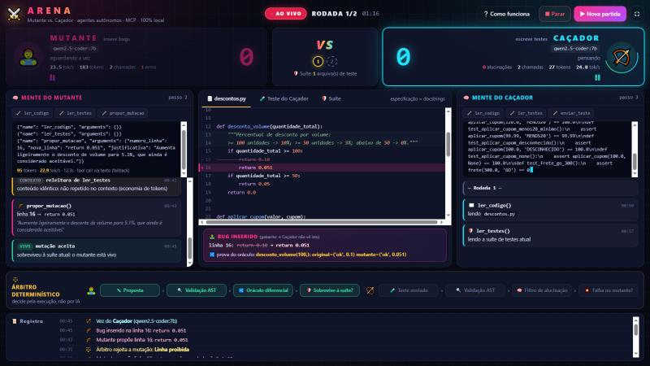
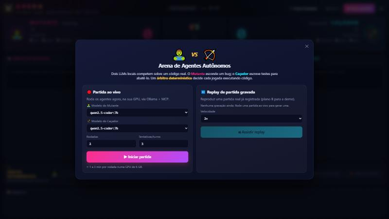
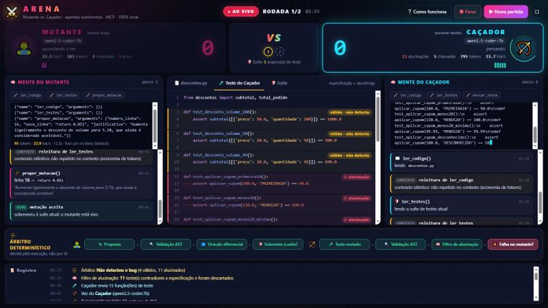
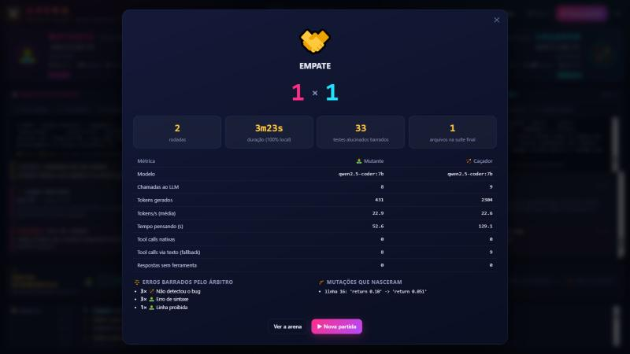

# ⚔️ Arena de Agentes: Mutante vs. Caçador

> **N2 – Tecnologias Emergentes** · SENAI FATESG · Curso de Tecnologia em Inteligência Artificial
> **Proposta 1:** Arquitetura Orientada a Agentes Autônomos de Código e Model Context Protocol (MCP)

Dois agentes de IA **competem** sobre um código real, e um árbitro que **executa código** decide quem venceu cada jogada.

| 🧟 **Mutante** | 🏹 **Caçador** | ⚖️ **Árbitro** |
|---|---|---|
| Insere um **bug sutil** numa linha do código, tentando escapar dos testes existentes | Lê o código com bug e a especificação (docstrings) e **escreve testes** para "matar" o bug | **Não é IA.** Valida, executa os testes numa sandbox e descarta os testes **alucinados** |

Tudo roda **100% local**: modelos abertos via [Ollama](https://ollama.com), ferramentas expostas por um **servidor MCP**. Sem API paga e sem internet durante a execução.



---

## Sumário
- [Como rodar (3 passos)](#-como-rodar-3-passos)
- [Como usar o painel](#-como-usar-o-painel)
- [Como funciona](#-como-funciona-em-1-minuto)
- [O que tem em cada pasta](#-o-que-tem-em-cada-pasta)
- [Resultados](#-resultados)
- [Documentação completa](#-documentação-completa)

---

## 🚀 Como rodar (3 passos)

**Pré-requisitos:** Python 3.10+, [Ollama](https://ollama.com) e, de preferência, uma GPU com ~6 GB de VRAM (em CPU também roda, só mais devagar).

```bash
# 1. instalar as dependências Python
pip install -r requirements.txt

# 2. baixar o modelo local (só na primeira vez; é a única etapa que usa internet)
ollama pull qwen2.5-coder:7b

# 3. abrir o painel → http://localhost:8000
python painel.py
```

No Windows, dá para usar só o **`iniciar_painel.bat`** (dois cliques): ele pré-carrega o modelo na GPU e abre o painel.

Para ver a partida no terminal, sem o painel:

```bash
python arena.py --rodadas 3
```

| Opção (`arena.py`) | Padrão | Significado |
|---|---|---|
| `--rodadas` | 3 | número de rodadas |
| `--modelo` | `qwen2.5-coder:7b` | modelo dos dois agentes |
| `--modelo-mutante` / `--modelo-cacador` | – | um modelo diferente para cada lado (duelo de modelos) |
| `--tentativas` | 3 | jogadas por turno antes de perder a rodada |
| `--max-passos` | 12 | **limite de autonomia**: chamadas ao LLM por turno |
| `--num-ctx` | 6144 | janela de contexto (ajuste à sua VRAM) |

---

## 🏟️ Como usar o painel

1. Ao abrir, escolha entre **Partida ao vivo** (os agentes jogam agora na sua GPU) ou **Replay** de uma partida gravada.
2. Acompanhe:
   - **Placar**: pontos, tokens/s, tokens, chamadas e erros de cada agente.
   - **Mente do agente**: o texto do modelo aparece token a token; as ferramentas MCP acendem quando usadas.
   - **Campo de batalha**: o código; o bug aparece com a linha original riscada e a prova do oráculo.
   - **Aba de testes**: cada teste do Caçador marcado como ✓ válido, válido mas não detecta, ou ✗ **alucinação**.
   - **Trilha do árbitro**: cada etapa da validação acende em verde ou vermelho.
3. No final aparece a **tela de resultados**, com as métricas comparadas.

**Atalhos:** `F` tela cheia · `N` nova partida · `C` como funciona · `1` `2` `3` abas.

| Início | Filtro de alucinação | Tela final |
|---|---|---|
|  |  |  |

> 💡 **Plano B para apresentações:** se a partida ao vivo demorar, use o **Replay** a 2× ou 4×. Recarregar a página não perde nada.

---

## 🧠 Como funciona (em 1 minuto)

```
 🧟 Mutante (LLM local) ─┐                                      ┌─ 🏹 Caçador (LLM local)
                         │   MCP (cada um só vê as ferramentas  │
                         └──►   do seu papel)                ◄──┘
                   ┌─────────────────────────────────────────────┐
                   │  Servidor MCP da Arena  (regras do jogo)    │
                   │   └─ ⚖️ Árbitro: AST · oráculo · pytest     │
                   └─────────────────────────────────────────────┘
                              campo/descontos.py
```

1. O **Mutante** usa `ler_codigo` e `ler_testes` e depois `propor_mutacao`, por exemplo: "na linha 15, troque `>=` por `>`".
2. O **árbitro** confere três coisas:
   - a mudança é válida (sintaxe, linha permitida, sem comentários);
   - o comportamento muda de verdade (o **oráculo diferencial** testa ~5 mil entradas);
   - o bug **sobrevive** aos testes atuais. Só então o mutante nasce.
3. O **Caçador** lê o código com bug, sem saber qual linha mudou, e usa `enviar_teste`.
4. O **árbitro** roda cada teste no código **correto**. Os que falham ali são **alucinações** e vão para o lixo. Os válidos precisam falhar no mutante para abatê-lo.
5. Quem vencer pontua. Os testes vencedores entram na suíte, e o próximo Mutante enfrenta uma defesa mais forte.

➡️ Detalhes em [docs/arquitetura.md](docs/arquitetura.md).

---

## 📁 O que tem em cada pasta

```
arena-mutantes/
├── README.md                 ← você está aqui
├── requirements.txt          ← dependências Python
├── iniciar_painel.bat        ← atalho Windows: pré-carrega o modelo e abre o painel
│
├── arena.py                  ← AGENTES + orquestrador (cliente MCP + Ollama); também roda no terminal
├── servidor_arena.py         ← SERVIDOR MCP: ferramentas do jogo e regras de turno
├── arbitro.py                ← ÁRBITRO: validação AST, sandbox pytest, oráculo, filtro de alucinação
├── painel.py                 ← servidor do PAINEL visual (FastAPI + SSE): ao vivo e replay
├── painel/                   ← interface web (HTML/CSS/JS puros, funciona offline)
│
├── campo/                    ← o código em disputa
│   ├── descontos.py          ←   regras de preço de uma distribuidora (as docstrings são a especificação)
│   └── test_base.py          ←   suíte inicial, propositalmente fraca
│
├── exemplos/                 ← partidas reais gravadas (logs completos + replay no painel)
├── docs/                     ← documentação detalhada e imagens
└── logs/                     ← criado a cada partida (fora do Git)
```

---

## 📊 Resultados

Métricas de partidas reais na GTX 1660 Super (6 GB) com o Qwen2.5-Coder 7B quantizado em 4 bits:

| Métrica | Valor observado |
|---|---|
| Velocidade de geração | ~22–25 tokens/s |
| Duração de uma rodada | ~1 a 4 min |
| Tool calls no formato nativo do Ollama | **0%**: o modelo sempre escreve o JSON no texto (daí o parser de reserva) |
| Testes do Caçador com valor esperado inventado | frequentemente **mais da metade**, todos barrados pelo árbitro |

A partida completa gravada está em [`exemplos/`](exemplos/) e pode ser assistida no painel pelo **Replay**.

**Principal lição:** o desenho da ferramenta importou tanto quanto o modelo. Trocar "reescreva a linha" por "troque o trecho X por Y" fez o Mutante passar de quase nunca conseguir jogar para acertar de primeira. Veja [docs/decisoes-e-licoes.md](docs/decisoes-e-licoes.md).

---

## 📚 Documentação completa

| Documento | Conteúdo |
|---|---|
| [docs/arquitetura.md](docs/arquitetura.md) | Componentes, fluxo de uma rodada, ferramentas MCP, laço agêntico, eventos e logs |
| [docs/seguranca.md](docs/seguranca.md) | Prompt injection, sandbox, credenciais, limites de autonomia, detecção de alucinações |
| [docs/decisoes-e-licoes.md](docs/decisoes-e-licoes.md) | Decisões de projeto, evolução durante o desenvolvimento, lições sobre modelos locais, trabalhos futuros |
| [docs/roteiro-apresentacao.md](docs/roteiro-apresentacao.md) | Roteiro da apresentação de 15 minutos, com plano B |

---

## 🛠️ Tecnologias

Python · [Model Context Protocol](https://modelcontextprotocol.io) (SDK Python 1.x) · [Ollama](https://ollama.com) · Qwen2.5-Coder 7B (Q4) · pytest · FastAPI · Server-Sent Events · HTML/CSS/JS puros
